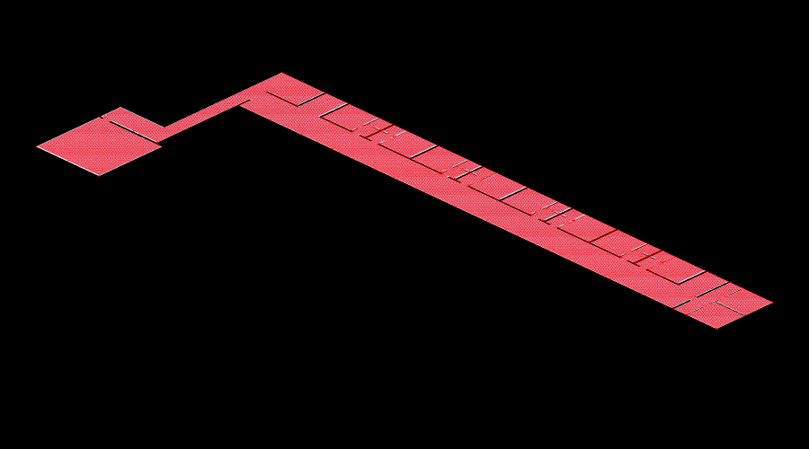
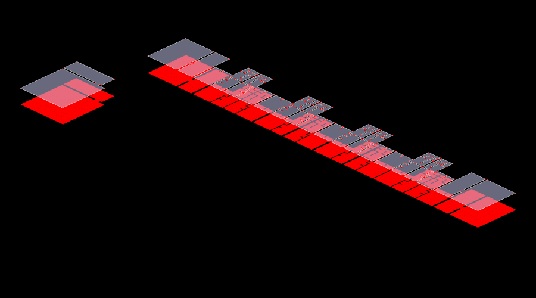

**Graph Analysis of Narkomfin Building — Type K Apartment (Two Floors)**

GraphML — Assignment 02 by Group 02

TopologicPy + Python (Jupyter Notebook)

**Building Overview**

The Narkomfin Building was designed by Moisei Ginzburg and Ignaty Milinis and completed in 1930 in Moscow. It is one of the most significant examples of Soviet Constructivist housing, designed around the principle of collective living. The building organises private dwelling units along a linear corridor spine, with shared communal facilities accessed from the ends and the roof.

The Type K apartment is a two-storey duplex unit. The lower floor (L1) is a long, narrow plan dominated by a single continuous corridor that runs the full length of the unit, with rooms branching off to one side. The upper floor (L2) is fragmented into eleven disconnected zones — individual rooms, service areas, and balconies — connected back to L1 by a set of internal stairs. The two floors are linked by twelve stair surfaces whose centroids were automatically identified from the OBJ geometry.

The aim of this report is to apply graph-based spatial analysis to the combined two-floor plan. The floor plans were converted into spatial graphs by overlaying a regular 0.5-unit grid, filtering points inside the floor boundaries using ray-casting point-in-polygon testing, building 4-neighbour adjacency graphs per floor, and stitching them with stair edges to form a single cross-floor network. Seven metrics were computed and visualised: the Building Graph, Degree Centrality, Closeness Centrality, Betweenness Centrality, Clustering Coefficient, Shortest Path, and Community Detection.

**Floor plan topology**

L1 is a single continuous face with 244 vertices defining a concave boundary — the long corridor spine with room alcoves and the kitchen/bathroom block at the west end. L2 comprises eleven separate faces: individual rooms, a bathroom, and balcony areas. The fragmentation of L2 is immediately visible in the graph — disconnected islands that rely entirely on stairs for cross-floor access.

**Building graph**

The combined building graph at GRID_SIZE=0.5. Red dots are graph nodes (cell centroids), grey lines are adjacency edges, and vertical lines are stair connections between L1 and L2. The two floors are separated vertically for visual clarity.

Key findings:

* L1 reads as a dense, continuous mesh — the long corridor spine produces an unbroken chain of well-connected cells running the full length of the unit. This is the primary circulation backbone of the apartment.
* L2 is visibly fragmented. Each room appears as a separate island of connected cells, linked to L1 only through the vertical stair edges. There are no horizontal connections between L2 rooms — you must go down to L1 and back up to move between them.
* The stair edges (vertical lines) cluster in the centre of the plan, creating a narrow band of cross-floor connectivity. The west-end rooms and the east-end balconies are the most remote from any stair.
* The graph density is very low (0.0028), reflecting the linear, corridor-dominated topology. Unlike the Musashino Library's open-field connectivity, the Narkomfin plan is fundamentally sequential.

**Closeness centrality — heatmap**

Colour shows how globally accessible each cell is. Yellow and orange mark the most integrated cells; blue and purple mark cells that take the longest to reach from everywhere else.

Key findings:

* The brightest region — highest closeness — forms a hot band running along the L1 main corridor, roughly in the centre-to-east portion of the plan. This is the topological heart of the apartment: the cells with the shortest average path distance to every other cell in the building.
* The gradient is strikingly linear. Closeness falls off steadily toward both ends of the corridor — west toward the kitchen block and east toward the far rooms. There is no single central hub; instead, there is a central zone that functions as a distributed spine of accessibility.
* L2 rooms are uniformly blue-purple, confirming they are topologically deep. Reaching any L2 room from L1 requires traversing to a stair location, climbing, and then navigating within the isolated room. The rooms at the east and west extremes of L2 are the darkest — the most remote spaces in the entire apartment.
* The two detached volumes at the far west (the kitchen block and its adjacent space) are the coldest cells on L1, consistent with their dead-end position in the plan. They connect to the main corridor through a narrow link.
* Architecturally, this confirms the Constructivist design logic: the corridor is not merely a passage but the primary spatial integrator of the unit. The increasing depth toward L2 rooms creates a privacy gradient — public/shared circulation on L1, private retreat spaces on L2 — achieved purely through topological distance rather than doors or locks.

**Betweenness centrality — heatmap**

Colour shows how often each cell lies on shortest paths between all other pairs of cells. Yellow marks critical bottlenecks; dark blue marks cells that carry no through-traffic.

Key findings:

* The highest betweenness forms a razor-sharp hot line running along the L1 corridor centreline. This is the most striking result: virtually all cross-building movement must pass through a single narrow band of cells. The corridor is not just accessible — it is the sole routing channel for the entire apartment.
* The stair landing zones on L1 show localised betweenness spikes. These cells absorb all vertical traffic between the two floors, making them critical chokepoints. If any stair connection were blocked, the corresponding L2 rooms would become completely unreachable.
* L2 rooms are almost entirely dark — near-zero betweenness. They are destination spaces only; no shortest path between any two other cells passes through them. They are topological dead ends in the circulation network.
* The corridor shows a secondary gradient: betweenness is highest in the centre (where L1-to-L2 stair traffic converges) and tapers toward the ends. The far-west kitchen block and the far-east rooms carry very little through-traffic because few shortest paths route through endpoints.
* Compared to the Musashino Library, where betweenness was distributed across multiple parallel paths through the open floor, the Narkomfin plan concentrates all betweenness into a single linear spine. This makes the building efficient but fragile — any obstruction on the corridor would sever circulation for the entire apartment.

**Shortest path**

The red line is the topological shortest path from the upper-left of L1 to the lower-right of L2 — a full cross-floor diagonal traversal. The blue line is the geometrically straightened version within each floor's boundary. The vertical red segment is the stair connection between floors.

Key findings:

* The path runs the full length of the L1 corridor before ascending via a stair near the east end to reach L2. The corridor functions as a mandatory transit spine — there is no shortcut or alternative route through the interior.
* The straightened (blue) path closely follows the topological (red) path, indicating that the grid graph already produces a geometrically efficient route. The corridor is so narrow that there is little room for path optimisation — the topology and geometry are nearly identical.
* The stair transition appears as a single vertical jump. The path selects the stair closest to the destination, confirming that stair placement directly controls cross-floor routing efficiency.
* This path reveals the fundamental movement logic of the Type K duplex: horizontal traversal is long but unobstructed (the corridor); vertical traversal is short but constrained to specific stair locations. The building trades vertical flexibility for horizontal efficiency.

**Degree centrality — heatmap**

Colour shows how many direct neighbours each cell has. Yellow marks cells with the most immediate connections; purple marks cells that touch few others.

Key findings:

* The floor plan is almost uniformly orange, indicating that the vast majority of cells have the same number of direct neighbours (4 for interior cells, 2-3 for edge cells). This uniformity reflects the corridor-dominated plan: the long, straight spine offers consistent local connectivity throughout.
* The few bright yellow spots (visible near the corridor centre on L1) correspond to cells at stair landing zones, where the stair edge adds a fifth connection (the vertical link to L2). These are the only cells in the building with above-average local degree.
* L2 rooms show slightly cooler tones at their edges and corners, where cells touch the room boundary and lose one or two neighbours. The interiors of larger L2 rooms are the same orange as L1 — locally, a room interior has the same connectivity as a corridor interior.
* Unlike the Musashino Library, where degree centrality revealed a dramatic contrast between the open convergence zone and the dead-end bays, the Narkomfin plan has very little degree variation. The building is topologically flat at the local scale — the hierarchy only emerges at the global scale (closeness, betweenness).

**Clustering coefficient**

The clustering coefficient measures how interconnected a node's immediate neighbours are — whether they also connect to each other, forming triangles.

Key findings:

* The entire heatmap is uniformly dark — all clustering coefficients are zero. This is the expected result for a 4-neighbour grid graph: in a rectilinear grid, no two neighbours of a cell are themselves neighbours (the north and east neighbours of a cell do not share an edge). Triangles cannot form.
* This confirms that the Narkomfin plan has no locally clustered spatial zones. There are no areas where rooms loop back on themselves to create pocket neighbourhoods. The plan is strictly sequential: every movement choice is a straight line or a right-angle turn.
* The zero clustering is architecturally meaningful. In contrast to buildings with atria, courtyards, or ring corridors (which would produce non-zero clustering), the Narkomfin plan enforces a linear, hierarchical spatial logic. You cannot loop — you can only go forward or back.

**Community detection**

Each colour marks a distinct cluster of cells that are more densely connected internally than to the rest of the network. The Louvain algorithm groups the plan into zones based purely on graph topology.

Key findings:

* **Purple/dark blue (west portion of L1 + west L2 rooms)** — the kitchen block, its adjacent space, and the western L2 rooms form a single community. These cells share their closest stair connections and are topologically remote from the east end, so the algorithm groups them as a self-contained western zone.
* **Blue/teal (centre-west of L1 + centre L2 rooms)** — the central portion of the corridor and its associated L2 rooms above form another community. This zone contains the most stair connections and functions as the building's circulation core.
* **Green (centre-east of L1 + associated L2 rooms)** — a transition zone between the central core and the far-east rooms. The corridor continues to provide horizontal connectivity, but the L2 rooms above begin to fragment.
* **Yellow-green (far east of L1 + east L2 rooms and balconies)** — the eastern extremity of the apartment. These cells are the most remote from the centre and cluster together as a distinct endpoint community.
* The community boundaries run roughly perpendicular to the corridor — slicing the apartment into longitudinal zones rather than separating L1 from L2. This means the stair connections are strong enough to bind each L2 room to its nearest L1 corridor segment, rather than letting the floors separate into their own communities. The building's vertical integration is working as intended.
* The community map reveals a **linear zonal model**: the apartment is not divided into rooms (the building's architectural logic) but into longitudinal bands (the graph's topological logic). Each band contains a segment of the L1 corridor plus the L2 rooms directly above it. This is the graph's description of how the Constructivist duplex organises space — not as discrete floors, but as vertical slices of a single spatial system.

**Conclusion**

**Circulation Patterns** The Type K apartment operates with a single dominant circulation system: the L1 corridor spine. Unlike the Musashino Library's dual system (local browsing core + long-distance perimeter), the Narkomfin plan channels all movement — local and long-distance — through the same linear corridor. Vertical movement is available only at the stair locations, which the betweenness analysis confirms as critical chokepoints.

**Hierarchy of Spaces** There is a clear two-tier spatial hierarchy. The L1 corridor is maximally accessible and carries virtually all through-traffic (highest closeness and betweenness). The L2 rooms are topological dead ends — highly accessible locally but completely removed from the building's circulation network. This is a deliberate design choice: the corridor provides efficient shared movement; the duplex rooms provide private retreat.

**Accessibility and Connectivity** Accessibility follows a linear gradient along the corridor, peaking in the centre and falling toward both ends. The west kitchen block and the far-east rooms are the most remote. Cross-floor accessibility is entirely dependent on stair placement — the graph confirms that stairs are the only structural connection between the two floors, and their central clustering means the building's extremities are the least accessible spaces.

**Functional Zoning** The community detection reveals that the apartment self-organises into longitudinal bands — vertical slices that each contain a corridor segment and its overhead rooms. This is the spatial signature of the Constructivist duplex: the corridor is not a boundary between public and private but a shared spine that binds each vertical slice into a coherent unit. The privacy gradient runs upward (L1 corridor to L2 rooms), not laterally.

**Why graph analysis is useful for this building** The Narkomfin Type K is architecturally compact — two floors, one corridor, a dozen rooms — but the graph analysis reveals a spatial logic that is invisible in a plan drawing. The betweenness heatmap exposes the corridor as a single-point-of-failure routing spine. The closeness gradient quantifies the privacy hierarchy between floors. And the community detection shows that the building's true spatial units are not floors or rooms but vertical slices — a finding that aligns with Ginzburg's original intent of creating integrated living cells rather than stacked apartments.
