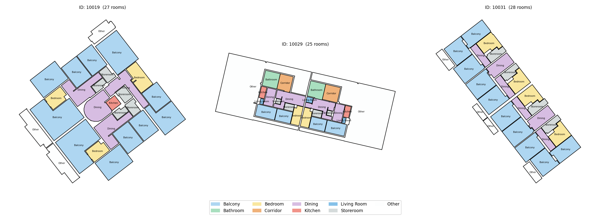
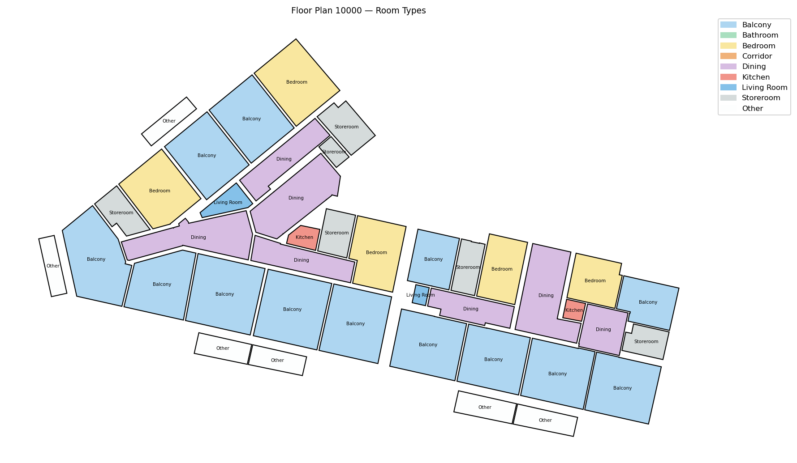
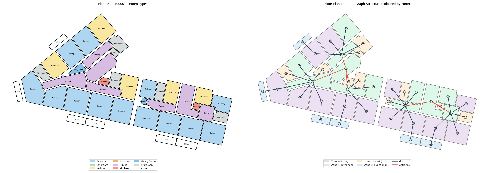

<!-- _class: title -->

  
MaCAD 2025/26 · Digital Tools for Graph Machine Learning

  <h1>GraphML_G02</h1>
  
Graph Learning Pipeline for Architectural Floor Plans

  

  

    

      
Final Assignment

      
IAAC &nbsp;·&nbsp; MaCAD 2025/26

    

    

      Lakzhmy Zaro 
      María Sánchez 
      Charles Abi Chahine 
      Emilie El Chidiac
    

  

---

Digital tools for Graph Machine LearningFinal Assignment - G02

  <h1 style="color:var(--rust); font-size:1.6em; margin-bottom:4px">Contents</h1>
  
This week we explored the Swiss Dwellings dataset and the research papers behind it, and defined the next steps for our graph ML pipeline.

  

    

      
01

      

        
Dataset

        
Modified Swiss Dwellings — 5,372 residential floor plans as NetworkX graphs · Plan 10000 selected

      

    

    

      
02

      

        
Research

        
MSD benchmark paper (ECCV 2024) · GNN node classification paper (eCAADe 2024)

      

    

    

      
03

      

        
Graph Structure

        
graph_in vs graph_out — zone labels, connectivity, and room type prediction

      

    

    

      
04

      

        
Next Steps

        
Floor plan recreation → graph construction → analysis → node classification

      

    

  

---

Digital tools for Graph Machine LearningFinal Assignment - G02

  

01

Dataset

  <h1>Modified Swiss Dwellings</h1>
  

  

    5,372 floor plans
    Multi-apartment clusters
    Corridor buildings
    Single units
    Graph modality only
  

  

    
  

  
3 sample plans — wide variety of residential typologies, scales and orientations

  

    

5,372

Floor Plans

    

4

Zone Types

    

9

Room Types

    

.pickle

Graph Format

  

---

Digital tools for Graph Machine LearningFinal Assignment - G02

  

01

Dataset — Selected Plan

  <h1>Plan 10000 — Multi-Apartment Cluster</h1>
  

  

    

      

        
      

      
Room types — rendered from graph_out geometry

    

    

      

        

          
41

          

Rooms

across 2 apartments

        

        

          
2

          

Apartments

sharing a common entrance

        

        

          
✓

          

Ground Truth

validate predictions against MSD labels

        

      

      

        Cluster typology
        Diagonal layout
      

    

  

---

Digital tools for Graph Machine LearningFinal Assignment - G02

  

02

Research

  <h1>Literature</h1>
  

  

    

      

        
Paper 1

        
MSD: A Benchmark Dataset for Floor Plan Generation of Building Complexes

        
ECCV 2024 · TU Delft

        <ul>
          <li>5,372 Swiss residential floor plans</li>
          <li>3 modalities: image, geometry, graph</li>
          <li>Richer than RPLAN &amp; LIFULL — multi-apartment, compass orientation, inter-unit links</li>
          <li>Graph encodes spatial zones, not room types</li>
        </ul>
        
This dataset is our primary data source.

      

    

    

      

        
Paper 2

        
GNN for Node Classification and Attribute Allocation in Architectural BIM

        
eCAADe 2024 · Cardiff University

        <ul>
          <li>Uses the same MSD dataset</li>
          <li>Converts floor plans to graphs via TopologicPy</li>
          <li>Benchmarks GCN, GAT, GraphSAGE architectures</li>
          <li>GraphSAGE-Pool, 4 layers — ~95% accuracy</li>
        </ul>
        
The pretrained model from this paper is what we will run on our floor plan.

      

    

  

---

Digital tools for Graph Machine LearningFinal Assignment - G02

  

03

Graph Structure

  <h1>Data Structure</h1>
  

  

    

      
graph_in — model input

      <table class="tbl">
        <tr><th>Attribute</th><th>Type</th><th>Values</th></tr>
        <tr><td><code>zoning_type</code></td><td>int</td><td class="val">0 · 1 · 2 · 3</td></tr>
        <tr><td><code>connectivity</code></td><td>str</td><td class="val">'door' · 'entrance'</td></tr>
      </table>
      
graph_out — ground truth

      <table class="tbl">
        <tr><th>Attribute</th><th>Type</th><th>Description</th></tr>
        <tr><td><code>room_type</code></td><td>int</td><td class="val">0 – 8</td></tr>
        <tr><td><code>geometry</code></td><td>Polygon</td><td>2D room outline</td></tr>
        <tr><td><code>centroid</code></td><td>Point</td><td>centre of room</td></tr>
      </table>
    

    

      
Room types (0 – 8)

      <table class="tbl">
        <tr><th>ID</th><th>Room</th><th>ID</th><th>Room</th></tr>
        <tr><td class="val">0</td><td>Balcony</td><td class="val">5</td><td>Kitchen</td></tr>
        <tr><td class="val">1</td><td>Bathroom</td><td class="val">6</td><td>Living Room</td></tr>
        <tr><td class="val">2</td><td>Bedroom</td><td class="val">7</td><td>Storeroom</td></tr>
        <tr><td class="val">3</td><td>Corridor</td><td class="val">8</td><td>Other</td></tr>
        <tr><td class="val">4</td><td>Dining</td><td></td><td></td></tr>
      </table>
      
Zone types (0 – 3)

      <table class="tbl">
        <tr><th>ID</th><th>Zone</th><th>Typical rooms</th></tr>
        <tr><td class="val">0</td><td>Living</td><td>Living room, dining</td></tr>
        <tr><td class="val">1</td><td>Dynamic</td><td>Corridor, entrance</td></tr>
        <tr><td class="val">2</td><td>Static</td><td>Bedroom, bathroom</td></tr>
        <tr><td class="val">3</td><td>Functional</td><td>Kitchen, storeroom</td></tr>
      </table>
    

  

---

Digital tools for Graph Machine LearningFinal Assignment - G02

  

03

Graph Structure

  <h1>From Plan to Graph — Plan 10000</h1>
  

  
  
Plan 10000 — room types (left) and spatial connectivity graph (right)

  

    

      
Zone label per node

      
graph_in input

    

    
→

    

      
Graph topology

      
door / entrance edges

    

    
→

    

      
Room type prediction

      
GraphSAGE-Pool output

    

  

---

Digital tools for Graph Machine LearningFinal Assignment - G02

  

04

Next Steps

  <h1>Pipeline</h1>
  

  

    

      
01

      

        
Floor Plan Recreation

        
Recreate plan 10000 in Rhino. Room boundaries as closed polylines with shared edges between adjacent rooms — required for TopologicPy to detect adjacency.

      

    

    

      
02

      

        
Graph Construction — TopologicPy

        
Convert the Rhino geometry into a graph. Assign zoning_type to nodes and door/entrance labels to edges to match the MSD input format.

      

    

    

      
03

      

        
Graph Analysis — NetworkX

        
Compute degree, betweenness, and closeness centrality. Analyse spatial connectivity patterns across the floor plan.

      

    

    

      
04

      

        
Node Classification — GraphSAGE-Pool

        
Run the pretrained model on our graph. Predict room_type from zone labels and connectivity. Compare against ground truth from MSD.

      

    

  

