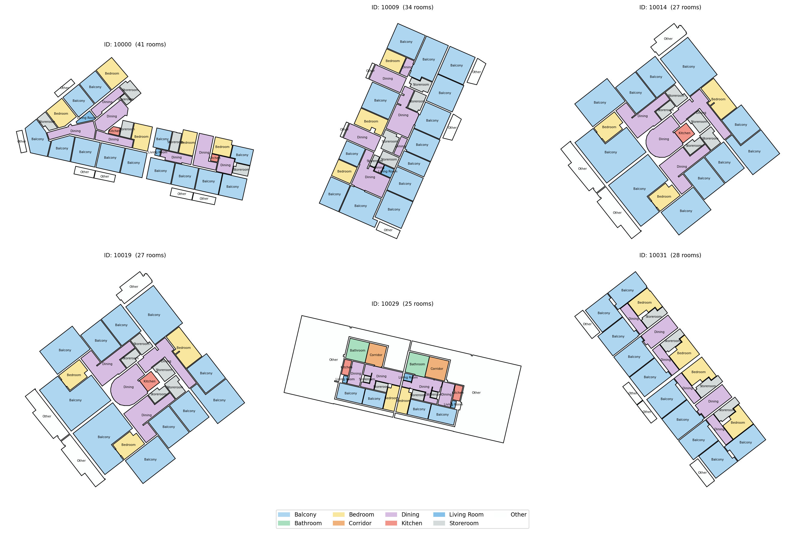

<!-- _class: title -->

IAAC MaCad · AIA26 S.3 Graph ML · 2025–26

# GraphML_G02

Graph Learning Pipeline for Architectural Floor Plans

  <b>01</b> Dataset &ensp; <b>02</b> Research &ensp; <b>03</b> Graph Structure &ensp; <b>04</b> Next Steps

Charles Abi Chahine · Emilie El Chidiac · Lakzhmy Zaro · Maria Sánchez i Domínguez

---

<!-- _class: content -->

## 01 — Dataset
# Modified Swiss Dwellings

5,372 Swiss residential floor plans, each stored as a NetworkX graph in <code>.pickle</code> format. Three modalities exist — image, geometry, and graph — but we work exclusively with the <strong>graph modality</strong>. The pickle file has no visual on its own; the floor plans below were rendered by reading the polygon geometry stored on each graph node and drawing them with matplotlib.

  

Plans 10000, 10009, 10014, 10019 — rendered from graph_out node geometry

  

5,372

Floor Plans

  

4

Zone Types

  

9

Room Types

  

.pickle

Graph Format

---

<!-- _class: content -->

## 02 — Research
# Literature

  

    

      
Paper 1

      
MSD: A Benchmark Dataset for Floor Plan Generation of Building Complexes

      
ECCV 2024 · TU Delft

      <ul>
        <li>5,372 Swiss residential floor plans</li>
        <li>3 modalities: image, geometry, graph</li>
        <li>Richer than RPLAN & LIFULL — multi-apartment, compass orientation, inter-unit links</li>
        <li>Graph encodes spatial zones, not room types</li>
      </ul>
      
This dataset is our primary data source.

    

  

  

    

      
Paper 2

      
GNN for Node Classification and Attribute Allocation in Architectural BIM

      
eCAADe 2024 · Cardiff University

      <ul>
        <li>Uses the same MSD dataset</li>
        <li>Converts floor plans to graphs via TopologicPy</li>
        <li>Benchmarks GCN, GAT, GraphSAGE architectures</li>
        <li>GraphSAGE-Pool, 4 layers — ~95% accuracy</li>
      </ul>
      
The pretrained model from this paper is what we will run on our floor plan.

    

  

---

<!-- _class: content -->

## 03 — Graph Structure
# From Plan to Graph — Plan 10000

Each plan is stored as two paired graphs. <strong>graph_out</strong> (left) holds the ground-truth room type per node, plus polygon geometry — this is what we rendered to visualise the plan. <strong>graph_in</strong> (right) holds only zone labels and connectivity — this is what the model actually sees. No shapes, no areas, no coordinates. Room function must be inferred from topology alone.

  

    

      
    

    
<strong>graph_out</strong> — room_type (0–8) + polygon geometry per node

  

  

    

      
    

    
<strong>graph_in</strong> — zoning_type (0–3) per node · door / entrance edges

  

  

Model input

zoning_type 0–3

  

Edge type

door · entrance

  

Model target

room_type 0–8

  

Geometry used

topology only

---

<!-- _class: content -->

## 04 — Next Steps
# Pipeline

  

    
Step 1

    

      
Floor Plan Recreation

      
Recreate plan 10000 in Rhino. Clean room boundaries as closed polylines with shared edges between adjacent rooms.

    

  

  

    
Step 2

    

      
Graph Construction — TopologicPy

      
Convert the Rhino geometry into a graph. Assign zoning_type to nodes and door/entrance labels to edges to match the MSD input format.

    

  

  

    
Step 3

    

      
Graph Analysis — NetworkX

      
Compute degree, betweenness, and closeness centrality. Analyse spatial connectivity patterns across the floor plan.

    

  

  

    
Step 4

    

      
Node Classification — GraphSAGE-Pool

      
Run the pretrained model on our graph. Predict room_type from zone labels and connectivity. Compare against ground truth from MSD.

    

  

